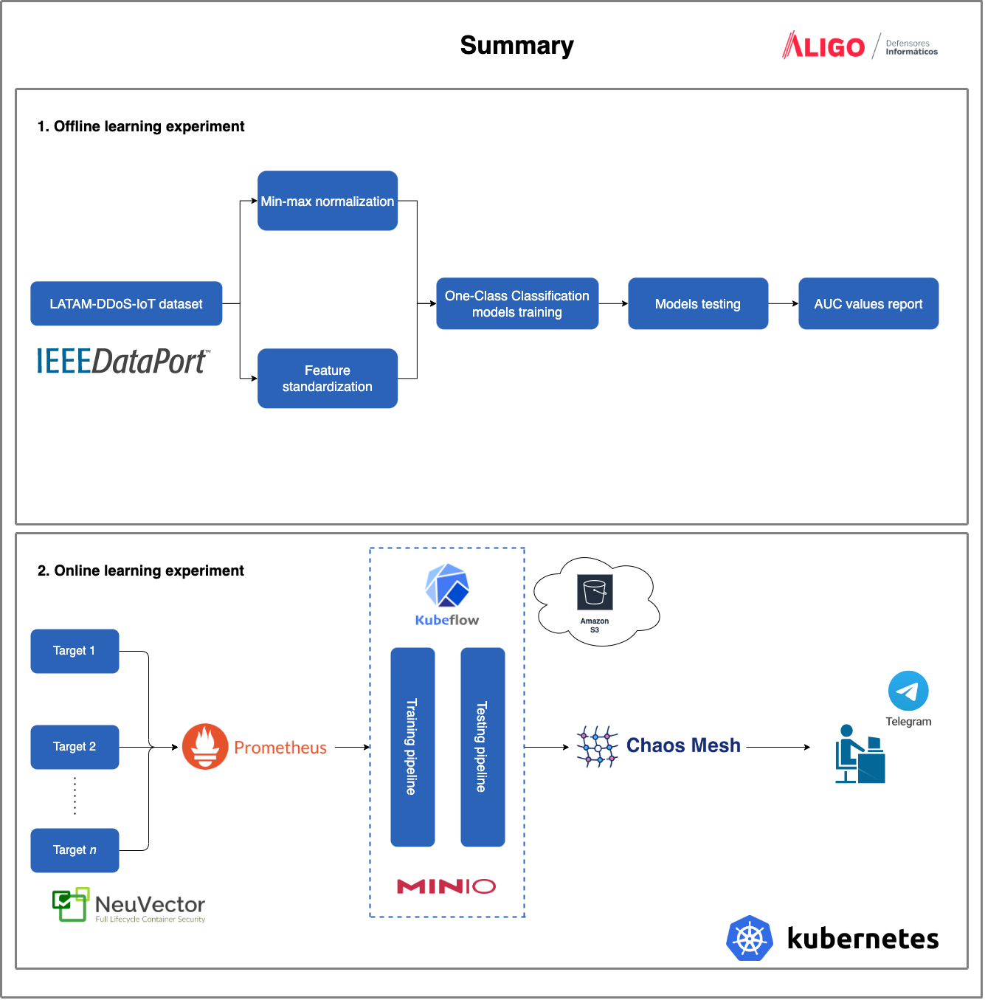

# An Anomaly-based Detection System for Monitoring Kubernetes Infrastructures
> Paper published in IEEE Latin America Transactions

    

The code in this repository is divided by the type of experiment conducted in the research: either offline or online learning. Sensitive data was eliminated (i.e., IP addresses, ports, and API keys), therefore, be careful when running some notebooks since that information needs to be filled in according to the setup of each user. For more details, please take a look at the paper.
